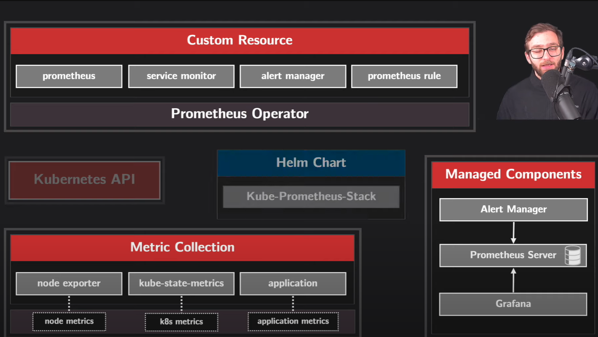

## Prometheus Operator (kube-prometheus-stack)

The **Prometheus Operator** is a **Kubernetes-native way** to deploy and manage **Prometheus monitoring** efficiently. It automates tasks such as:
- **Deployment** of Prometheus, Alertmanager, and Grafana  
- **Service discovery** of Kubernetes workloads  
- **Configuration management** using Kubernetes Custom Resources  
- **`kube-prometheus-stack`** is the **Helm chart** that deploys:
    - **Prometheus Operator**
    - **Prometheus**
    - **Alertmanager**
    - **Grafana**
    - **Kube State Metrics**
    - **Node Exporter**
- Features
    - Uses `ServiceMonitor` & `PodMonitor` instead of scape configs
    - Scaling & Management is done as Kubernetes CRDs
    - Comes with Alertmanager
- **Understanding Prometheus Operator Components**
    | **Component** | **Purpose** |
    |--------------|------------|
    | **Prometheus Operator** | Manages Prometheus instances in Kubernetes |
    | **Prometheus** | Collects and stores metrics |
    | **Alertmanager** | Manages alerts and notifications |
    | **Grafana** | Provides dashboards for visualization |
    | **kube-state-metrics** | Exposes Kubernetes object metrics |
    | **node-exporter** | Collects node-level system metrics |

## Prometheus Operator Archicture
https://www.youtube.com/watch?v=ihCy7BfidyE 



- **Prometheus Operator and Custom Resources**  : The **Prometheus Operator** is a Kubernetes controller that automates the deployment and configuration of Prometheus components using **Custom Resource Definitions (CRDs)**.  
- **Prometheus Custom Resource (CR)**  : The **Prometheus CR** is deployed as part of the monitoring stack. It instructs the **Prometheus Operator** to create and manage a **Prometheus server** within the cluster.  
- The operator ensures that the Prometheus instance is properly configured, highly available, and updated based on changes to the CR.  
- **Other Custom Resources**  
    - **ServiceMonitor CR:** Defines which services should be monitored and specifies their metric endpoints.  
    - **PrometheusRule CR:** Contains alerting rules that define when and how alerts should be triggered.  
    - **Alertmanager CR:** Specifies how Alertmanager should be deployed and configured.  
- **Prometheus Server: Data Collection and Storage**  : The **Prometheus server** is the central component responsible for collecting, processing, and storing metrics.  
- **Time-Series Database (TSDB)**  :Prometheus stores collected metrics in a **time-series database**, optimized for handling time-stamped data efficiently.  
    - The database consists of:  
        - **Chunks:** Data blocks containing metric samples over a period of time.  
        - **Indexes:** Metadata that helps locate specific metrics quickly.  
        - **WAL (Write-Ahead Log):** Ensures data persistence and recovery in case of failure.  
- **Scraping Metrics from Exporters**  : Prometheus collects metrics by scraping data from various **exporters** that expose metrics in a format that Prometheus understands.  
    - **Node Exporter:**  
        - Collects **system-level metrics** such as CPU usage, memory consumption, disk I/O, and network statistics.  
        - Runs on each node in the Kubernetes cluster and exposes metrics at an HTTP endpoint (e.g., `http://<node>:9100/metrics`).  
    - **kube-state-metrics:**  
        - Collects **Kubernetes resource metrics** such as pod status, deployment availability, and service health.  
        - Provides insights into the internal state of the Kubernetes cluster.  

- **Connecting Exporters to Prometheus Using Service Monitors**  : While exporters expose metrics at predefined HTTP endpoints, Prometheus needs a mechanism to **discover and scrape** these endpoints. This is achieved using **ServiceMonitor CRs**.  
- **ServiceMonitor Custom Resource**  
    - A **ServiceMonitor CR** defines:  
    - The **namespace and labels** of the services to be monitored.  
    - The **port and path** where metrics are exposed.  
    - The **scraping interval** and other configurations.  
    - The **Prometheus Operator** watches for new ServiceMonitor CRs and automatically configures Prometheus to scrape the specified targets.  
- **Interaction with the Kubernetes API**  
    - Prometheus interacts with the **Kubernetes API server** to:  
        - Discover running pods and services.  
        - Retrieve metadata about monitored resources.  
        - Dynamically adjust its target list based on changes in the cluster.  
---

#### **Deploy Prometheus Operator (kube-prometheus-stack) in a Kubernetes Cluster**
- https://www.devopscube.com/setup-prometheus-operator/
- **Prerequisites:**  
    - A running **Kubernetes cluster**  
    - **Helm** and **kubectl installed**installed  
- **Step 1️: Add the Helm Repo**
    ```sh
    # Add the Prometheus community Helm chart.
    helm repo add prometheus-community https://prometheus-community.github.io/helm-charts
    # Update the Helm repository
    helm repo update
    ```
- **Step 2️: Install kube-prometheus-stack**
    - Before the installation of the operator, we need to get the values file of the helm chart so that we can make configuration changes if we want.
        ```sh
        # To get the values file, use the following command. Use this file to modify configurations
        helm show values prometheus-community/kube-prometheus-stack > values.yaml
        # install the Prometheus Operator using the Helm
        helm install prometheus prometheus-community/kube-prometheus-stack --namespace prometheus-operator --create-namespace
        ```
        - This deploys **Prometheus, Grafana, Alertmanager, and exporters**.

#### **Monitor Kubernetes with Prometheus Operator**
- **Step 1: Verify the Installation**
    ```sh
    kubectl get pods -n prometheus-operator
    # Grafana, Prometheus Operator and Kube State Metrics are deployed as Deployment Objects.
    kubectl get deployments -n prometheus-operator

    # Alertmanager and Prometheus are deployed as StatefulSets.
    kubectl get statefulsets -n prometheus-operator

    # The Node Exporter is deployed as a Daemonset
    kubectl get daemonsets -n prometheus-operator
    ```
    - Deployments
        - **Grafana:** Visualize the metrics
        - **Prometheus Operator:** It is a controller to manage and configure the Prometheus stack
        - **Kube state metrics:** Collect the Kubernetes API Server metrics,
    - StatefulSets
        - **Alertmanager:** Sending alerts via email or notifications
        - **Prometheus**: Collect metrics
        - Prometheus and Alertmanager are deployed as StatefulSet objects because Prometheus has the Time Series Database that stores the metrics, and both these Objects have configurations, so it does need persistent volumes.
            - Because of the persistent volume, the data will persist even if the Pod is removed or rescheduled. 
    - Daemonset
        - **Node Exporter** is deployed as a Daemonset because this object ensures that the Node Exporter is available on each node to collect the metrics.

- **Step 2: Accesing the Services**
    ```sh
    # view the Services created.
    kubectl get svc -n prometheus-operator
    ```
    - Deploying the Prometheus Operator will create custom resources to monitor the default Kubernetes resources, such as nodes, API server, kube-proxy, kubelet, etc.
    - We need to perform the port forwarding to see the web UI of Prometheus, Alertmanager, or Grafana (or you can also cahnge the service type to LoadBalanacer and skip below step).
    - To view the Dashboard of the Prometheus, use the following command.
    ```sh
    kubectl port-forward -n prometheus-operator svc/prometheus-kube-prometheus-prometheus 9090:9090
    ```
    - **Prometheus UI** → `http://<ip>:9090`
    - **Grafana Dashboard** → Access at: `http://<ip>>:3000`  
        - **Username:** `admin`, **Password:** `prom-operator`
- **Step 3: Accesing the ServiceMoniters**
    ```sh
    kubectl get crds -n prometheus-operator
    kubectl get servicemonitor -n prometheus-operator

    ```
    - A `ServiceMonitor` is a Custom Resource Definition (CRD) provided by the Prometheus Operator that allows automatic service discovery for Prometheus. Instead of manually defining scrape configurations in `prometheus.yml`, Prometheus automatically discovers and scrapes metrics from services in Kubernetes using ServiceMonitor resources.
        - `ServiceMonitor` Dynamically detects new services
        - Handles multiple services with labels
    -  How ServiceMonitor Works
        - Prometheus Operator watches for ServiceMonitor CRDs
        - It discovers services matching the selector
        - Prometheus automatically scrapes metrics from those services
    - How Prometheus Operator Uses ServiceMonitor
        - Prometheus Operator automatically discovers ServiceMonitor resources
        - If a service matches the labels, Prometheus will scrape metrics
        - No need to edit Prometheus scrape configs manually

