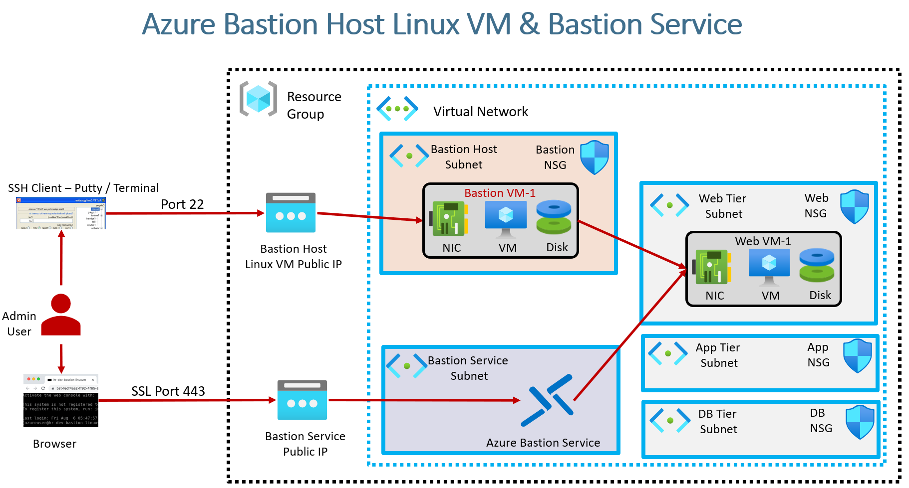
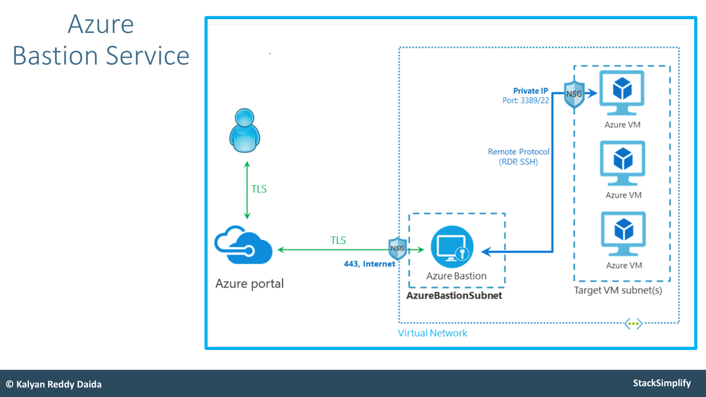
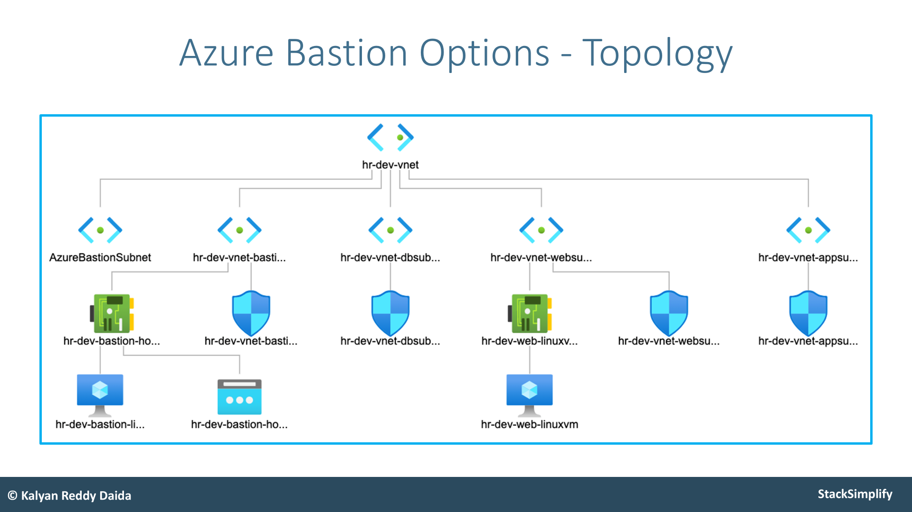

## **Real-World Demo 3: Implementing Azure Bastion and Bastion Host VM**

#### **Introduction**
This demo focuses on securing access to Azure virtual machines (VMs) by removing public IP exposure and enabling secure SSH connectivity using either of the following approach:
- **Azure Bastion Host Service** (Platform as a Service - PaaS)
- **Bastion Host Linux VM** (Traditional approach)

Both methods ensure secure VM access without exposing them directly to the internet.

**Architecture Overview**
- **Existing Setup**
    - A **four-tier virtual network** has already been set up.
    - A **Web Linux VM** is deployed in the **web-tier subnet**.
    - Previously, this VM had a **public IP**, allowing direct SSH access.
- **New Secure Setup**
    - **Public IP is removed** from the Web Linux VM.
    - **Two secure access options are introduced**:
        - **Option 1: Bastion Host Linux VM** (Jump Server)
        - **Option 2: Azure Bastion Service** (PaaS)

#### **Option 1: Bastion Host Linux VM**
- A **Bastion Linux VM** is created in a **dedicated Bastion subnet**.
- This Bastion VM has a **public IP** and **Network Interface Card (NIC)**.
- Users connect **via SSH (port 22)** to the Bastion VM.
- From the Bastion VM, users can SSH into any private VM inside the network (Web, App, or DB subnets).
- **Network Security Groups (NSG)** are configured to allow only necessary traffic.
- **Advantages:**
    - Cost-effective, as the VM can be stopped when not in use.
    - Familiar approach widely used in traditional IT environments.
- **Disadvantages:**
    - Requires **manual maintenance** and security configurations.

#### **Option 2: Azure Bastion Service**
- A **dedicated Azure Bastion subnet** (`AzureBastionSubnet`) is created.
- **Azure Bastion Service** is deployed inside this subnet.
- Users connect securely via **TLS** through the **Azure Portal (Web-based SSH/RDP)**.
- **No need for a public IP** on the target VMs.
- **Always running**, billing is based on session usage.
- **Advantages:**
    - **More secure** as it is managed by Azure.
    - No need to manage SSH keys or jump servers.
    - Simple browser-based access.
- **Disadvantages:**
    - **More expensive** than a Bastion Host VM.
    - Cannot be **stopped** when not in use.

### **Network Topology**
The final setup includes:
- **Web, App, and DB subnets**, each with **network security groups (NSGs)**.
- **Bastion Host VM** with **Bastion NIC and public IP**.
- **Azure Bastion Subnet** with **Azure Bastion Service**.
- The **Web Linux VM no longer has a public IP**.

Users can now securely access VMs through:
1. **Bastion Host VM (Jump Server)**
2. **Azure Bastion Service (Browser-based TLS access)**

### **Terraform Implementation**
The infrastructure is provisioned using Terraform configurations:

1. **Four-Tier Virtual Network** (`c1` to `c6-07`)
2. **Azure Linux VM in Web Subnet** (`c7-01` to `c7-06`)
   - Public IP removed for security.
3. **Bastion Implementations** (`c8-01` to `c8-05`)
   - **Bastion Host Linux VM** in the Bastion Subnet.
   - **Azure Bastion Service** in the Azure Bastion Subnet.

This ensures **secure, private access** to the VMs inside the virtual network.

---

### **Conclusion**
- **Option 1**: Traditional **Bastion Host Linux VM** (Jump Server) – cost-effective, but requires manual maintenance.
- **Option 2**: **Azure Bastion Service** – managed, secure, but costlier and always running.
- Organizations can choose **either approach** based on their **security and cost considerations**.

In the next steps, Terraform configurations will be applied to **deploy these secure access mechanisms** and validate connectivity to private VMs.