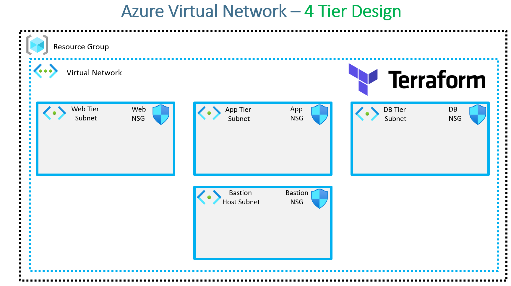

### **Real-World Demo 1**

In this demo, we will design an **Azure Virtual Network** with a **four-tier subnet architecture** and associated **Network Security Groups (NSGs)**.  

### **Architecture Overview**  

The infrastructure will consist of the following components:  

1. **Resource Group** – The foundational container for all resources.  
2. **Virtual Network (VNet)** – A logically isolated network.  
3. **Four Subnets** within the Virtual Network:  
   - **Web Tier Subnet**  
   - **App Tier Subnet**  
   - **Database (DB) Tier Subnet**  
   - **Bastion Host Subnet**  
4. **Network Security Groups (NSGs)** – Each subnet will have an associated NSG to control inbound and outbound traffic.  

Using **Terraform**, we will provision this entire setup. Once deployed, the **Azure Virtual Network topology** will have the following structure:  

- A **Virtual Network** containing **four subnets** (Web, App, DB, and Bastion).  
- Each subnet will have a **dedicated NSG**.  

**Terraform Concepts Covered**  

 
1. **Terraform Configuration Structure**  
   - Writing the **Terraform settings block**.  
   - Defining the **Terraform provider block**.  

2. **Terraform Variables & Values**  
   - **Input Variables** – Used to parameterize configurations.  
   - **Local Values** – Used for improved readability and reusability.  
   - **Output Values** – Used to extract and display important resource details.  

3. **Terraform Meta-Arguments**  
   - `for_each` – To efficiently manage multiple similar resources.  
   - `depends_on` – To ensure dependencies between resources are properly handled.  

4. **Terraform Resources to be Created**  
   - **Resource Group**  
   - **Virtual Network (VNet)**  
   - **Subnets (Web, App, DB, Bastion)**  
   - **Network Security Groups (NSGs)**  
   - **Network Security Rules** (e.g., allowing traffic on **port 80 (HTTP)** and **port 22 (SSH)**)  

5. **Terraform Design Best Practices**  
   - **Using maps and local values** to define security rules dynamically.  
   - **Organizing configuration files** into separate `.tf` files for better maintainability.  

**Configuration File Structure**  

To maintain clarity and modularity, the Terraform configuration files will be structured as follows:  

- `c1-versions.tf` – Defines **Terraform settings** and **provider blocks**.  
- `variables.tf` – Contains **input variables** for the entire project.  
- **Separate `.tf` files** for different resources:  
  - `virtual-network.tf` – Defines the **virtual network**.  
  - `web-tier.tf` – Defines the **Web Tier Subnet** and its **NSG**.  
  - `app-tier.tf` – Defines the **App Tier Subnet** and its **NSG**.  
  - `db-tier.tf` – Defines the **Database Tier Subnet** and its **NSG**.  
  - `bastion-tier.tf` – Defines the **Bastion Subnet** and its **NSG**.  

This structured approach ensures that changes can be made easily without affecting the entire configuration.  

